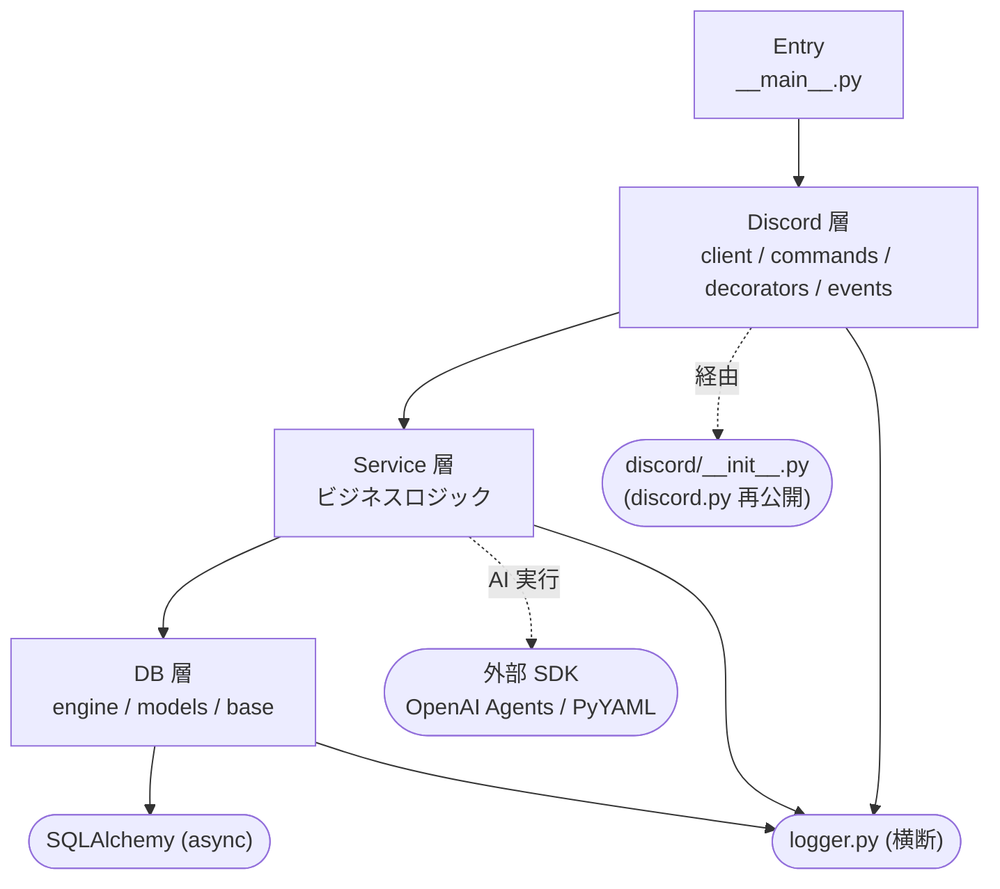
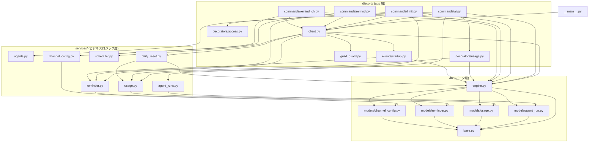
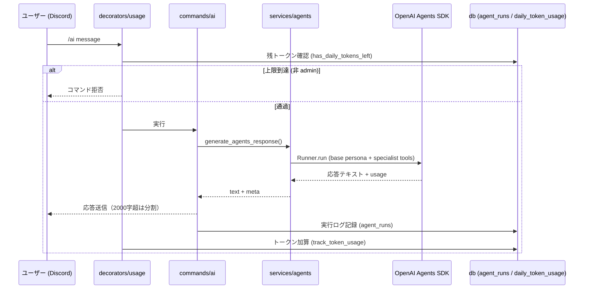

# アーキテクチャ

aibot は **リマインダー** と **AI 対話** の 2 機能を持つ Discord bot。
コードは 4 つのレイヤーに分かれ、依存は常に上位から下位へ一方向に流れる。

- **Entry**（`__main__.py`）— `.env` を読み、`DISCORD_TOKEN` で bot を起動する。
- **Discord 層**（`discord/`）— スラッシュコマンド・デコレータ・イベント。discord.py との境界。
- **Service 層**（`services/`）— ビジネスロジック。Discord にも DB の詳細にも依存しない。
- **DB 層**（`db/`）— SQLAlchemy 2.0 async ORM。engine・declarative base・モデル。

横断的に `logger.py` を全層が利用する（図では煩雑になるため省略）。

## 設計上の約束

- **依存は単方向**: Discord 層 → Service 層 → DB 層。逆流はない。
- **discord.py の re-export ハブ**: app 層は素の `discord` を直接 import せず、
  `discord/__init__.py`（`Interaction` / `app_commands` / `Embed` などを再公開）を経由する。
- **トランザクション境界は呼び出し側が持つ**: Service 層の関数は `AsyncSession` を
  引数で受け取る純粋なロジック。`get_session()`（`db/engine.py`）で囲むのは
  commands / decorators / events / daily_reset 側の責務。
- **スキーマ登録**: `db/engine.py` が `db.models` を import して metadata に全テーブルを
  登録し、`init_db()` の `create_all` で作成する。

## レイヤー依存図

## モジュール依存図

discord.py の re-export（`discord/__init__.py`）と `logger.py` は
ほぼ全モジュールが参照するため、図の見通しのため省略している。

## データフロー: `/ai`

使用量チェック → エージェント実行 → 応答送信 → ログ記録・使用量加算、の順で流れる。

## guild ゲーティング

個人コミュニティ運用のため、bot は **`ALLOWED_GUILD_IDS` に列挙した guild でのみ機能**する
（allowlist 型・fail-closed）。招待リンクが漏れても許可外サーバーでは動かず、`/ai` による
予算消費を防ぐ。実装は `discord/guild_guard.py` に集約し、多層で守る。

- **コマンド一元ゲート**: `GuildGuardCommandTree.interaction_check` が全スラッシュコマンドの
  実行前に guild を検証。許可外 / DM（`guild_id is None`）は ephemeral で拒否し、`/ai` は
  OpenAI を呼ぶ前に止まる。
- **参加時の自動退出**: `BotClient.on_guild_join` が許可外 guild から即 `leave()`。
- **起動時の掃除**: `BotClient._leave_unauthorized_guilds` が在籍中の許可外 guild から退出。
  ただし `ALLOWED_GUILD_IDS` が空のときはスキップ（設定忘れで全サーバーから抜ける事故を防ぐ）。

| 状況 | 挙動 |
|---|---|
| 許可 guild 内 | 通常実行 |
| 許可外 guild / DM | ephemeral で拒否（OpenAI を呼ばない） |
| 許可外 guild に参加 | 即 leave |
| 起動時に許可外 guild に在籍（allowlist 非空） | leave |
| allowlist が空 | コマンドは全拒否、ただし起動時 leave はしない |

## 環境変数

`.env`（または環境変数）で設定する。`__main__.py` が `python-dotenv` で読み込む。

| 変数 | 必須 | 用途 |
|---|---|---|
| `DISCORD_TOKEN` | ◯ | bot トークン |
| `OPENAI_API_KEY` | ◯（/ai 利用時） | OpenAI Agents SDK の実行 |
| `ALLOWED_GUILD_IDS` | ◯ | 動作を許可する guild ID（カンマ区切り）。未設定だと全コマンド拒否 |
| `ADMIN_USER_IDS` | ◯（/set-limit・上限バイパス） | 管理ユーザー ID（カンマ区切り、bot 全体） |
| `MAX_DAILY_USAGE` | 任意 | 1 日あたりトークン上限の既定値（既定 100） |
| `MAX_CHARS_PER_MESSAGE` | 任意 | 1 メッセージの最大文字数（既定 2000、上限 2000） |

## 外部依存

| ライブラリ | 用途 | 主な利用箇所 |
|---|---|---|
| discord.py | Discord クライアント / スラッシュコマンド | `discord/__init__.py`（再公開ハブ） |
| SQLAlchemy (asyncio) | async ORM・engine | `db/base.py`, `db/engine.py`, `db/models/*`, `services/*` |
| OpenAI Agents SDK (`agents`) | エージェント実行（`Agent` / `Runner`） | `services/agents.py` |
| PyYAML | `resources/agents.yml` の読み込み | `services/agents.py` |
| python-dotenv | `.env` 読み込み | `__main__.py` |
| zoneinfo（標準） | JST 境界の算出 | `services/reminder.py`, `services/usage.py` |

## データモデル

| テーブル | モデル | 役割 |
|---|---|---|
| `reminders` | `Reminder` | 予約されたリマインダー（`remind_at` は naive UTC） |
| `channel_configs` | `ChannelConfig` | ギルドごとのリマインダー送信先チャンネル |
| `agent_runs` | `AgentRun` | `/ai` の実行ログ（usage・tool_calls・status 等） |
| `user_token_limits` | `UserTokenLimit` | ユーザーごとの 1 日トークン上限（`user_id=0` は全体既定） |
| `daily_token_usage` | `DailyTokenUsage` | 日次トークン使用量（JST 日付で集計、毎日 0 時に掃除） |
